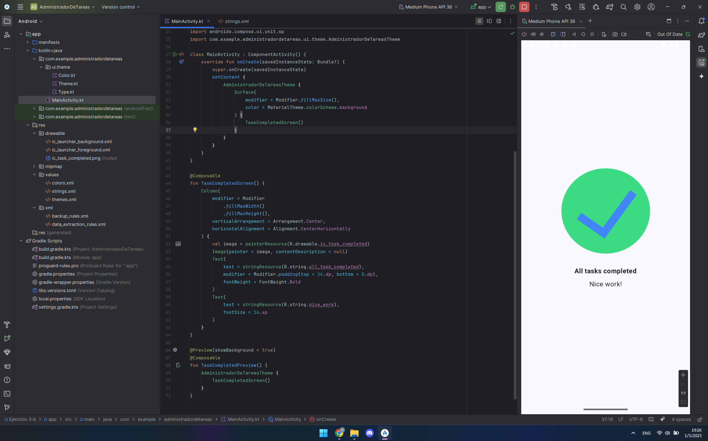

# ipdm-oto-2025--SantiagoFranco_ejercicio-3-b

## Descripción  
Aplicación Android desarrollada en Kotlin con Jetpack Compose que muestra un mensaje de "Tareas Completadas".  

**Funcionalidades principales**:  
- Muestra una imagen de confirmación (checkmark).  
- Texto con estilo personalizado (tamaño de fuente y alineación).  
- Diseño responsive para diferentes tamaños de pantalla.  

## Captura de Pantalla

